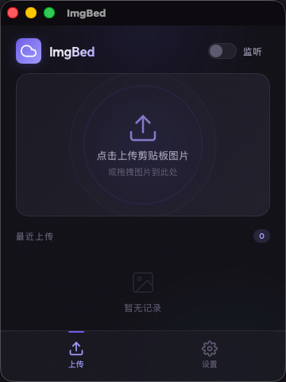
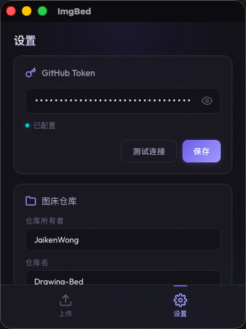

# ImgBed ☁️

macOS 剪贴板图床工具，基于 Tauri v2 + Rust + TypeScript。

截图/复制图片后，一键上传到 GitHub 仓库，自动复制 CDN 链接到剪贴板。

## 功能

- 🖼️ **剪贴板上传** — 检测剪贴板图片，一键上传
- 👀 **自动监听** — 后台监听剪贴板变化，截图即上传
- 📁 **文件选择** — 剪贴板无图片时自动弹出文件选择器
- 🎯 **拖拽上传** — 拖拽图片文件到上传区
- 🔗 **自动复制** — 上传成功自动复制 CDN 链接
- ⚙️ **可配置** — Token、仓库、分支、路径、CDN 全部可自定义
- 💾 **持久化** — 配置本地存储，重启不丢失

## 截图

**上传页** — 传送门风格上传区 + 历史记录



**设置页** — Token 配置 + 仓库设置 + 连接测试



## 快速开始

### 环境要求

- macOS 12+
- [Rust](https://rustup.rs/) 1.77+
- [Node.js](https://nodejs.org/) 18+
- [Xcode Command Line Tools](https://developer.apple.com/xcode/resources/)

### 安装依赖

```bash
cd imgbed
npm install
```

### 开发模式

```bash
npx tauri dev
```

### 构建发布

```bash
npx tauri build
```

构建产物在 `src-tauri/target/release/bundle/` 下。

## 配置

首次使用需在设置页配置：

1. **GitHub Token** — 在 [GitHub Settings → Tokens](https://github.com/settings/tokens) 生成，勾选 `repo` 权限
2. **仓库所有者** — 你的 GitHub 用户名
3. **仓库名** — 用作图床的仓库名
4. **分支** — 默认 `main`
5. **存储路径** — 图片在仓库中的路径前缀，默认 `images`
6. **CDN 地址** — 默认 `https://cdn.jsdelivr.net/gh`

### Token 获取

1. 打开 https://github.com/settings/tokens
2. 点击 **Generate new token (classic)**
3. 勾选 `repo` 权限
4. 生成后复制 `ghp_` 开头的字符串
5. 粘贴到设置页，点击 **测试连接** 验证

## 技术栈

| 层 | 技术 |
|---|---|
| 框架 | Tauri v2 |
| 后端 | Rust |
| 前端 | Vanilla TypeScript |
| 构建 | Vite |
| 剪贴板 | Swift / NSPasteboard |
| 持久化 | tauri-plugin-store |

## 项目结构

```
imgbed/
├── index.html              # 入口 HTML
├── package.json            # npm 依赖
├── vite.config.ts
├── src/
│   ├── main.ts             # 前端逻辑
│   └── styles.css          # 样式
└── src-tauri/
    ├── Cargo.toml          # Rust 依赖
    ├── tauri.conf.json     # Tauri 配置
    ├── capabilities/       # 权限配置
    └── src/
        ├── main.rs         # 入口
        ├── lib.rs          # 插件注册
        ├── clipboard.rs    # 剪贴板监听
        ├── upload.rs       # GitHub 上传
        └── store.rs        # 配置持久化
```

## License

MIT
